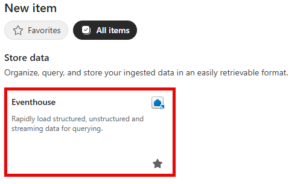
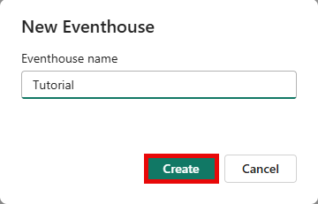
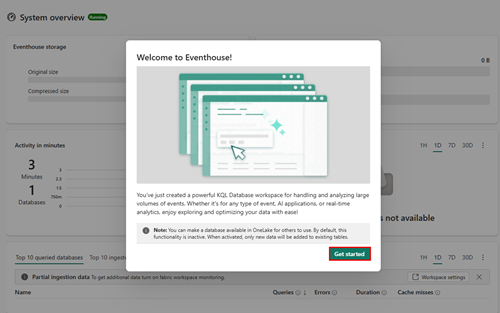

# Real-time intelligence tutorial part 1: Set up Eventhouse

> [!NOTE]
> This tutorial is part of a series. For the previous section, see [Introduction to the real-time intelligence tutorial](tutorial-introduction).

In this part of the tutorial, you set up the environment. Specifically, you create an [eventhouse](eventhouse) that automatically creates a child KQL database.

## Create an eventhouse

1. Browse to the workspace in which you want to create your tutorial resources. You must create all resources in the same workspace.
2. Select **+ New item**.
3. In the **Filter by item type** search box, enter **Eventhouse**.

    
4. Select the Eventhouse item.
5. Enter *Tutorial* as the eventhouse name and click **Create**. The Eventhouse and a KQL database are created simultaneously with the same name.

    
6. When provisioning is complete, click **Get started** in the welcome window.

    

    The eventhouse **System overview** page is shown.
