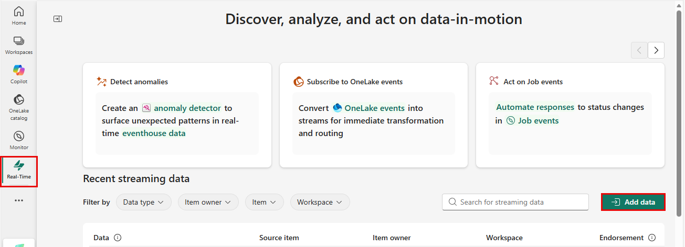
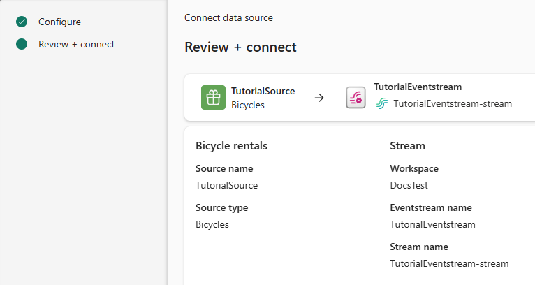
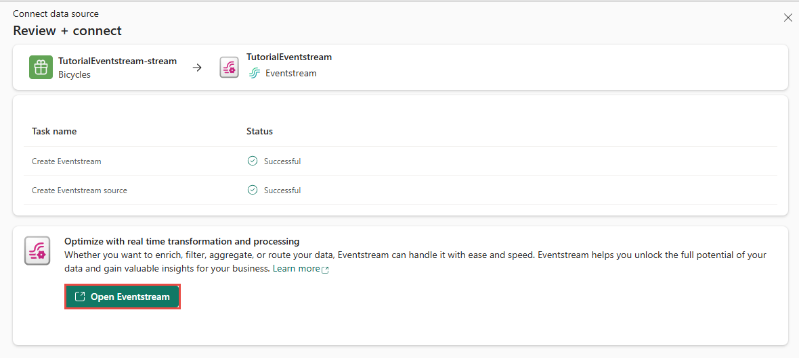
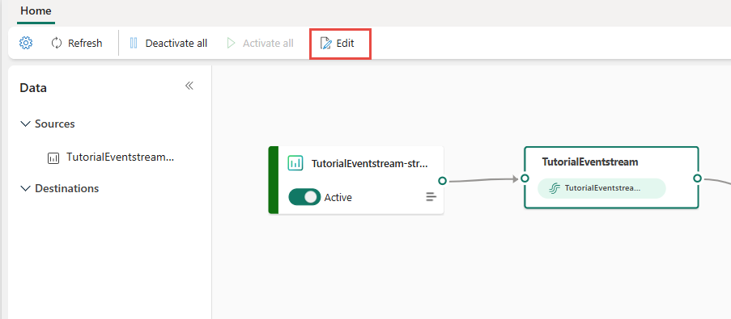
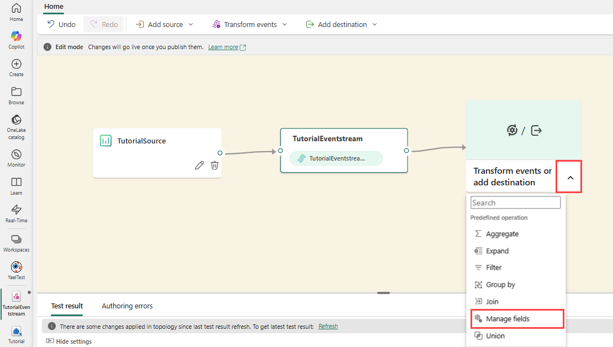
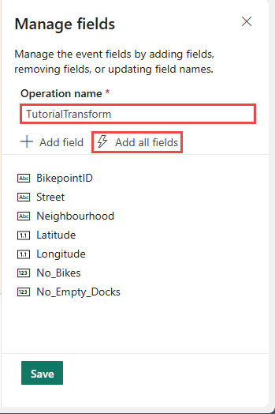
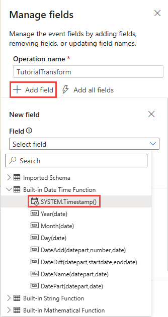
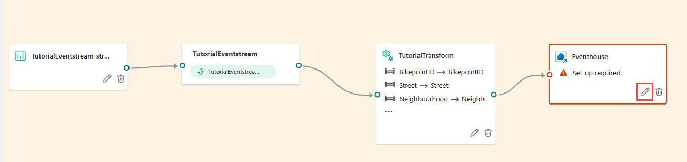

# Real-Time Intelligence tutorial part 2: Get data in the Real-Time hub

This part of the tutorial explains how to browse the Real-Time hub, create an eventstream, transform events, and create a destination to send the transformed events to a KQL database.

> [!NOTE]
> This tutorial is part of a series. For the previous section, see [Tutorial part 1: Set up Eventhouse](tutorial-1-resources).

## Create an eventstream

Use the sample gallery to create an eventstream that simulates bicycle rental data.

1. Select **Real-Time** in the left navigation bar.
2. Select **Add data** in the top-right corner of the page.

    
3. Under **Sample scenarios**, select **Connect** on the **Bicycle rentals** tile.
4. On the **Connect data source** page, for **Source name**, enter **TutorialSource**.
5. In the **Stream details** section, select the pencil button. Change the name of the eventstream to **TutorialEventstream**, and then select **Next**.
6. On the **Review + connect** page, review the settings, and select **Connect**.

    

## Transform events: Add a timestamp

Once the eventstream source is created, you can open the eventstream and add more settings.

1. After the eventstream is created, on the **Review + connect** page, select **Open Eventstream**.

    

    You can also browse to the eventstream from **My data streams** by selecting the stream and then selecting **Open Eventstream**.
2. On the menu ribbon, select **Edit**. The authoring canvas, which is the center section, turns yellow and becomes active for changes.

    
3. In the eventstream authoring canvas, select the down arrow on the **Transform events or add destination** tile, and then select **Manage fields**. The tile is renamed to `ManageFields`.

    
4. Select the pencil icon in the **Manage fields** pane, and follow these steps:

    1. In **Operation name**, enter **TutorialTransform**.
    2. Select **Add all fields**

        
    3. Select **+ Add Field**.
    4. From the **Field** dropdown, select **Built-in Date Time Function** > **SYSTEM.Timestamp()**.

        
    5. In **Name**, enter **Timestamp**.
    6. Select **Add**.
    7. Confirm that **Timestamp** is added to the field list, and select **Save**. The **TutorialTransform** tile shows an error because the destination isn't configured yet.

## Create a destination for the timestamp

Create a destination to send the transformed events to a KQL database.

1. Point to the right edge of the **TutorialTransform** tile and select the green plus icon.
2. Select **Destinations** > **Eventhouse** to create a destination.
3. Select the pencil icon on the **Eventhouse** tile.

    
4. In the **Eventhouse** pane, enter the following information:

    | Field | Value |
    | --- | --- |
    | **Data ingestion mode** | *Event processing before ingestion* |
    | **Destination name** | *TutorialDestination* |
    | **Workspace** | Select the workspace in which you created your resources. |
    | **Eventhouse** | *Tutorial* |
    | **KQL Database** | *Tutorial* |
    | **Destination table** | *Create new* - enter *RawData* as table name |
    | **Input data format** | *Json* |
5. Verify that the box **Activate ingestion after adding the data** is checked.
6. Select **Save**.
7. On the menu ribbon, select **Publish**.

    The eventstream is now set up to transform events and send them to a KQL database.
