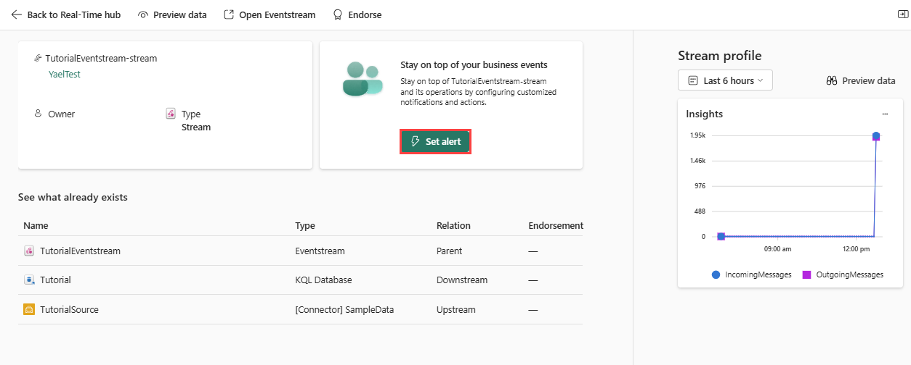
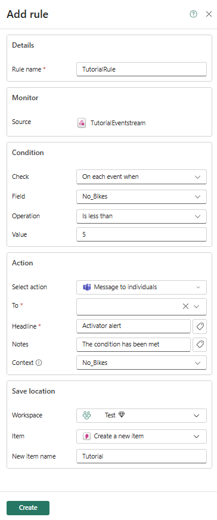

# Real-Time Intelligence tutorial part 3: Set an alert on your eventstream

> [!NOTE]
> This tutorial is part of a series. For the previous section, see: [Real-Time Intelligence tutorial part 2: Get data in the Real-Time hub](tutorial-2-get-real-time-events).

In this part of the tutorial, you set an Activator alert on your eventstream to receive a notification in Teams when the number of bikes falls below a certain threshold.

## Set an alert on the eventstream

Here you configure the rules for the alert.

1. From the left navigation bar, select **Real-Time**.
2. Select the **TutorialEventstream** eventstream you created in the previous tutorial. The eventstream details page opens.

    
3. Select **Set alert**
4. A new pane opens. Fill in the fields as follows:

    | Field | Value |
    | --- | --- |
    | **Details** |  |
    | Rule name | TutorialRule |
    | **Condition** |  |
    | Check | On each event when |
    | Field | No\_Bikes |
    | Condition | Is less than |
    | Value | 5 |
    | **Action** |  |
    | Select action | Message to individuals |
    | To | Your Teams account |
    | Headline | Activator alert |
    | Notes | The condition has been met |
    | Context | No\_Bikes |
    | **Save location** |  |
    | Workspace | The workspace in which you created resources |
    | Item | Create a new item |
    | New item name | Tutorial |

    
5. Select **Create**.

    The alert is set and you receive a notification in Teams when the condition is met.
