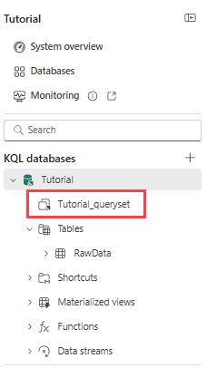
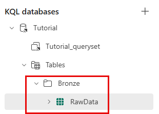
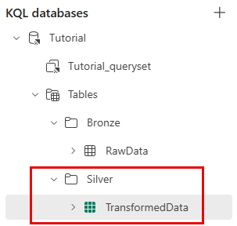
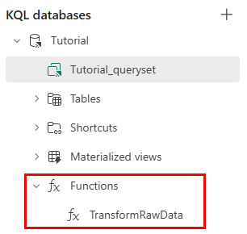

# Real-Time Intelligence tutorial part 4: Transform data in a KQL database

> [!NOTE]
> This tutorial is part of a series. For the previous section, see: [Real-Time Intelligence tutorial part 3: Set an alert on your eventstream](tutorial-3-set-alert).

In this part of the tutorial, you transform data in a KQL database using an update policy to trigger an automated mechanism when new data is written to a table. The policy eliminates the need for special orchestration by running a query to transform the ingested data and save the result to a destination table.

Multiple update policies can be defined on a single table, allowing for different transformations, and saving data to multiple tables simultaneously. The target tables can have a different schema, retention policy, and other policies from the source table.

## Move raw data table to a Bronze folder

In this step, you move the raw data table into a Bronze folder to organize the data in the KQL database.

1. Go to the workspace where you created resources.
2. Select the **Tutorial** KQL database you created earlier.
3. In the object tree, under the KQL database name, select the query workspace called **Tutorial\_queryset**.

    
4. Copy and paste the following command into the query editor to move the *RawData* table into a Bronze folder. Run the query by selecting the **Run** button in the menu ribbon or pressing **Shift + Enter**.

    ```kusto
    .alter table RawData (BikepointID:string,Street:string,Neighbourhood:string,Latitude:real,Longitude:real,No_Bikes:long,No_Empty_Docks:long,Timestamp:datetime) with (folder="Bronze")
    ```

    You see a new folder named **Bronze** containing a table called **RawData** under the **Tables** node in the object tree.

    

## Create a target table

In this step, you create a target table that is used to store the data transformed by the update policy.

1. On a new line, with at least one line between the cursor and the last query, copy and paste the following command to create a new table called **TransformedData** with a specified schema.

    ```kusto
    .create table TransformedData (BikepointID: int, Street: string, Neighbourhood: string, Latitude: real, Longitude: real, No_Bikes: long, No_Empty_Docks: long, Timestamp: datetime, BikesToBeFilled: long, Action: string) with (folder="Silver")
    ```
2. Run the command to create the table.

    You see a new folder named **Silver** containing a table called **TransformedData** under the **Tables** node in the object tree.

    

## Create a function with transformation logic

In this step, you create a stored function that holds the transformation logic to be used in the update policy. The function parses the *BikepointID* column and adds two new calculated columns.

1. From the menu ribbon, select **Database**.
2. Select **+ New** > **Function**.
3. Edit the function so it matches the following code, or copy and paste the following command into the query editor.

    ```kusto
    .create-or-alter function TransformRawData() {
    RawData
    | parse BikepointID with * "BikePoints_" BikepointID:int
    | extend BikesToBeFilled = No_Empty_Docks - No_Bikes
    | extend Action = iff(BikesToBeFilled > 0, tostring(BikesToBeFilled), "NA")
     }
    ```
4. Run the command to create the function.

    You see the function **TransformRawData** under the **Functions** node in the object tree.

    

## Apply an update policy

In this step, you apply an update policy to the target table to transform the data. The update policy uses the stored function *TransformRawData()* to parse the *BikepointID* column and adds two new calculated columns.

1. From the menu ribbon, select **Database**.
2. Select **+ New** > **Table update policy**.
3. Edit the policy so that it matches the following code, or copy/paste the following command into the query editor.

    ```kusto
     .alter table TransformedData policy update
     ```[{
         "IsEnabled": true,
         "Source": "RawData",
         "Query": "TransformRawData()",
         "IsTransactional": false,
         "PropagateIngestionProperties": false
     }]```
    ```
4. Run the command to create the update policy.

## Verify transformation

In this step, verify that the transformation is successful by comparing the output from the source and target tables.

> [!NOTE]
> It might take a few seconds to see data in the transformed table.

1. Copy and paste the following query into the query editor to view 10 arbitrary records in the source table. Run the query.

    ```kusto
    RawData
    | take 10
    ```
2. Copy and paste the following query into the query editor to view 10 arbitrary records in the target table. Run the query.

    ```kusto
    TransformedData
    | take 10
    ```

Notice that the BikepointID column in the target table no longer contains the prefix "BikePoints\_".
