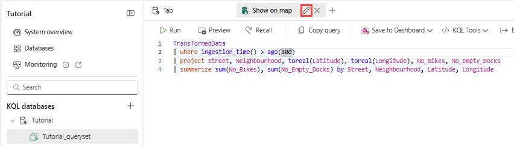
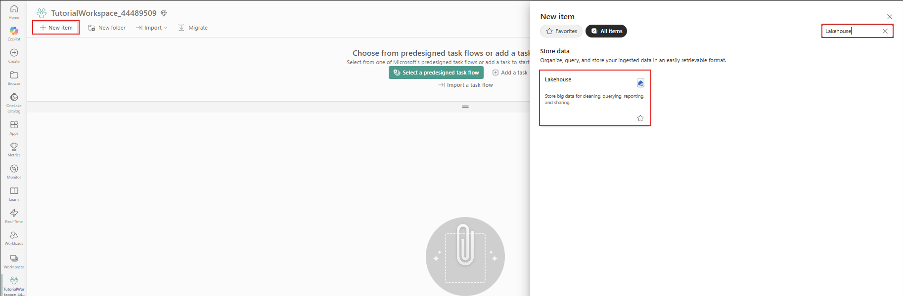
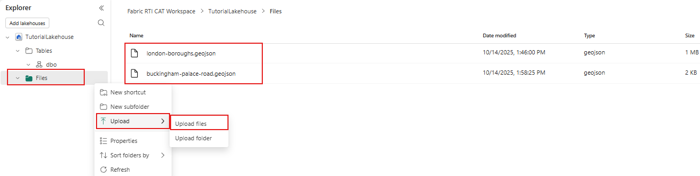
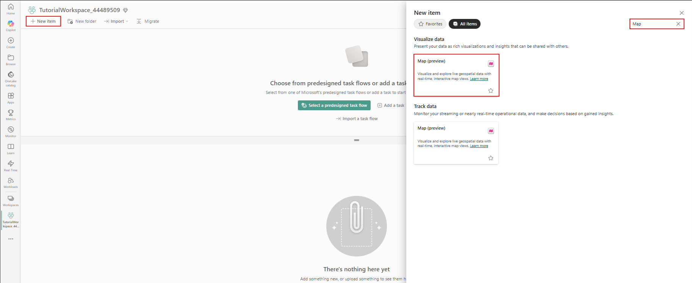
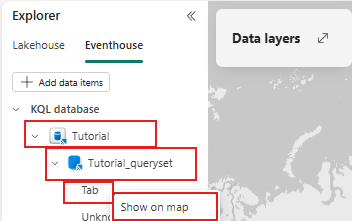
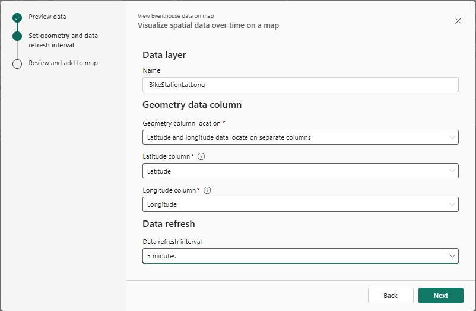
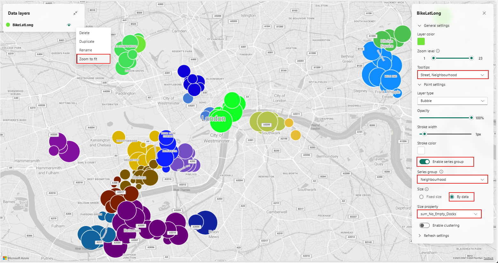
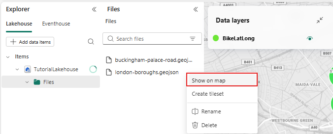
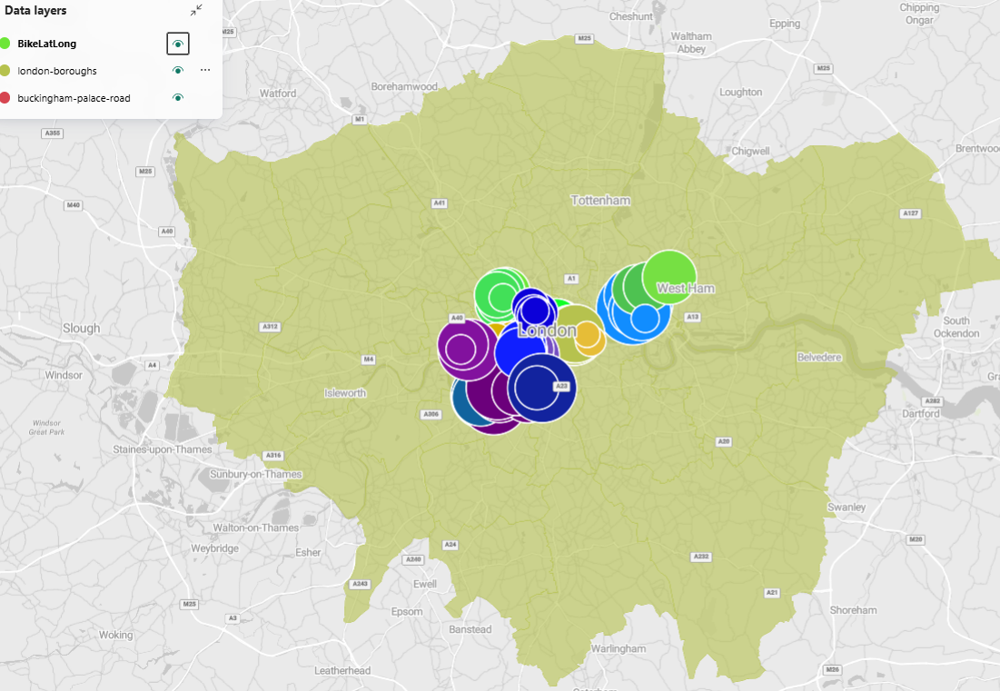
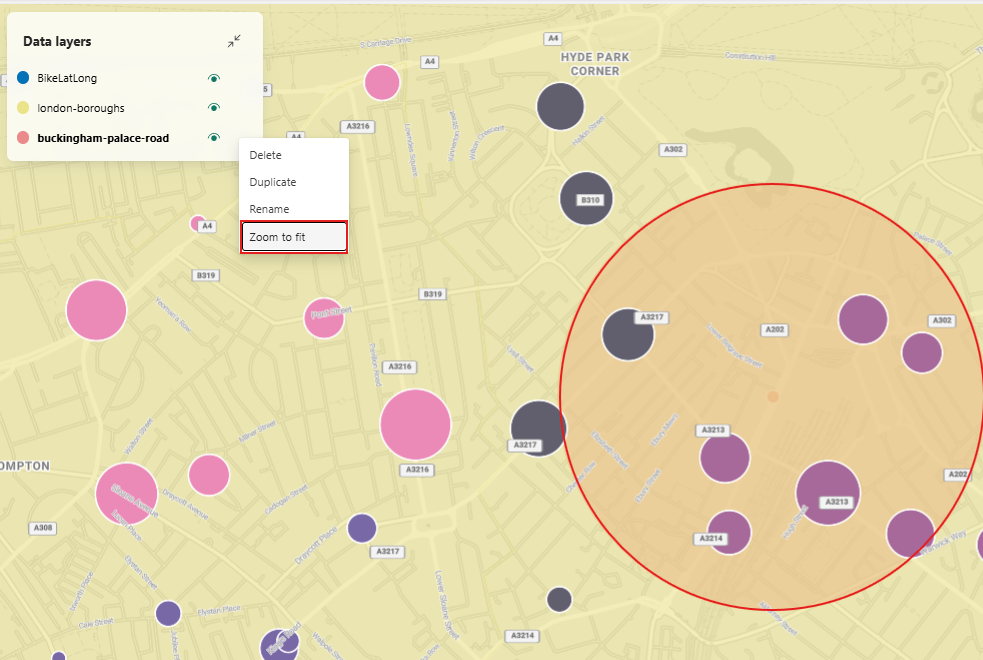

# Real-Time Intelligence tutorial part 8: Create a map using geospatial data

> [!NOTE]
> This tutorial is part of a series. For the previous section, see: [Tutorial part 7: Detect anomalies on an Eventhouse table](tutorial-7-create-anomaly-detection).

In this part of the tutorial, you learn how to create a map using geospatial data.

## Create a KQL Queryset tab to be used by the map

1. Open the **Tutorial** eventhouse that you created in the previous part of the tutorial.
2. Select the **Tutorial\_queryset**.
3. Select the **+** button on the ribbon to create a new tab.
4. Select the pencil icon on the tab and rename the query tab *Show on map*.
5. Copy/paste and run the following query.

    ```kusto
    TransformedData
    | where ingestion_time() > ago(30d)
    | project Street, Neighbourhood, toreal(Latitude), toreal(Longitude), No_Bikes, No_Empty_Docks
    | summarize sum(No_Bikes), sum(No_Empty_Docks) by Street, Neighbourhood, Latitude, Longitude
    ```

    [](media/tutorial/show-on-map.png#lightbox)

## Create a Lakehouse and upload GeoJson files

1. Browse to your workspace and in upper left corner select the **+ New item** button. Then search for and select **Lakehouse**.

    [](media/tutorial/lakehouse.png#lightbox)
2. Enter **TutorialLakehouse** as name.
3. Select the workspace in which you've created your resources.
4. Right-click the **File** node and under **Upload**, select **Upload files**.
5. Download the following two GeoJSON files from the following links and upload them to the Lakehouse.

    - [london-boroughs.geojson](https://github.com/microsoft/fabric-samples/blob/main/docs-samples/real-time-intelligence/london-boroughs.geojson)
    - [buckingham-palace-road.json](https://github.com/microsoft/fabric-samples/blob/main/docs-samples/real-time-intelligence/buckingham-palace-road.geojson)

    [](media/tutorial/lakehouse-upload-files.png#lightbox)

## Create a map

1. Browse to your workspace and in upper left corner select the **+ New item** button. Then search for and select **Map**.

    [](media/tutorial/map-item-creation.png#lightbox)
2. Enter *TutorialMap* in **Name**, and select **Create**

## Add Eventhouse data to the map

1. In the **Explorer** pane, select **Eventhouse** and select **+ Add data items** and choose the **Tutorial** eventhouse.
2. Select **Connect**.
3. Under Tutorial, select the **Tutorial\_queryset**.
4. Select the more menu (**...**) next to **Show on map** and select **Show on map**.

    [](media/tutorial/map-eventhouse.png#lightbox)
5. A new window showing data preview of the query opens. Select **Next** .
6. Enter *BikeLatLong* as Name. Select the **Latitude** and **Longitude** columns. Under **Data refresh interval** select 5 minutes. Select **Next**.

    [](media/tutorial/map-eventhouse-configure.png#lightbox)
7. In the next screen, select **Add to map**.
8. Right-click on **BikeLatLong** under **Data layers** and select **Zoom to fit** to zoom into London area showing bike stations on the map.
9. Under General settings, add Street and Neighbourhood under Tooltips.
10. Under Point settings, toggle **Enable series group** and select **Neighbourhood**.
11. Change **Size** to **By data** and select **sum\_No\_Empty\_Docks**.

    This should immediately take effect on the map with bubble sizes representing the number of empty docks and colors representing different neighbourhoods.

    [](media/tutorial/bubble-map.png#lightbox)

## Add GeoJSON files from Lakehouse to the map

1. In the **Explorer** pane, select **Lakehouse** and select **+ Add data items** and
2. Choose the **TutorialLakehouse** lakehouse and select **Connect**.
3. Under TutorialLakehouse, select the **london-boroughs.geojson** file and right-click on the file and select **Show on map**. Repeat the step for **buckingham-palace-road.json** file.

    [](media/tutorial/selection.png#lightbox)
4. We should see the borough boundaries and Buckingham Palace road on the map. You can toggle visibility of each layer by clicking the eye icon next to each layer under **Data layers**.

    [](media/tutorial/map-data-layers.png#lightbox)
5. Right-click on **buckingham-palace-road** under **Data layers** and select **Zoom to fit** to zoom into Buckingham Palace road area on the map.

    [](media/tutorial/zoom-buckingham-palace.png#lightbox)
6. From the menu bar, select the **Save** icon.
