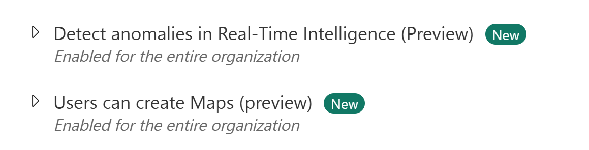

# Real-time intelligence tutorial

Real-time intelligence in Microsoft Fabric helps you extract insights and visualize streaming data in motion. This tutorial provides an end-to-end solution for event-driven scenarios, streaming data, and log analysis.

You'll learn how to set up and use the main features of real-time intelligence with a sample dataset.

For more information, see [What is real-time intelligence in Fabric?](overview).

## Scenario

The sample data you use in this tutorial is a set of bicycle data that includes information about bike ID, location, timestamp, and more. You learn how to set up resources, ingest data, set alerts on the data, and visualize the data to extract insights.

In this tutorial, you learn how to:

- Set up your environment
- Get data in the Real-Time hub
- Transform events
- Publish an eventstream
- Use update policies to transform data in Eventhouse
- Use Copilot to create a KQL query
- Create a KQL query
- Create an alert based on a KQL query
- Create a Real-Time dashboard
- Explore data visually in the Real-Time dashboard
- Set up anomaly detection on Eventhouse tables
- Create a map using geospatial data
- Set an alert on the eventstream

## Prerequisites

- To successfully complete this tutorial, you need a [workspace](../fundamentals/create-workspaces) with a Microsoft Fabric-enabled [capacity](../enterprise/licenses#capacity).
- The tenant admin must enable the maps and anomaly detector preview settings in the admin portal. For more information, see [What is the admin portal?](../admin/admin-center).

    
